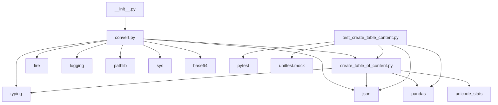

# Граф зависимостей проекта

## Обзор зависимостей

Данный раздел содержит анализ зависимостей между файлами проекта `jsonl2html`. Понимание графа зависимостей важно для поддержки и развития проекта.

## Диаграмма зависимостей модулей

## Зависимости по файлам

### Основные модули

#### `jsonl2html/__init__.py`
**Импортирует:**
- `convert` - основной модуль конвертации

#### `jsonl2html/convert.py`
**Импортирует:**
- `base64` - для кодирования данных
- `create_table_of_content` - модуль генерации оглавления
- `fire` - создание CLI интерфейса
- `json` - работа с JSON данными
- `logging` - логирование
- `pathlib` - работа с путями файлов
- `sys` - системные операции
- `typing` - типизация

#### `jsonl2html/create_table_of_content.py`
**Импортирует:**
- `json` - обработка JSON
- `pandas` - анализ данных
- `typing` - типизация
- `unicode_stats.aggregation` - агрегация Unicode статистики
- `unicode_stats.block_rules` - правила Unicode блоков

### Тестовые модули

#### `tests/test_create_table_content.py`
**Импортирует:**
- `json` - работа с тестовыми JSON данными
- `jsonl2html.create_table_of_content` - тестируемый модуль
- `pandas` - создание тестовых данных
- `pytest` - фреймворк тестирования
- `unittest.mock` - мокирование для тестов

### Конфигурационные файлы

#### `pyproject.toml`
*Нет внешних зависимостей* - конфигурационный файл

#### `requirements.txt`
*Нет внешних зависимостей* - список зависимостей

#### `ReadMe.md`
*Нет внешних зависимостей* - документация

## Обратные зависимости

### Внутренние модули

- **`convert`** используется в: `jsonl2html/__init__.py`
- **`create_table_of_content`** используется в: `jsonl2html/convert.py`

### Внешние библиотеки

- **`json`** используется в:
  - `jsonl2html/convert.py`
  - `jsonl2html/create_table_of_content.py`
  - `tests/test_create_table_content.py`

- **`typing`** используется в:
  - `jsonl2html/convert.py`
  - `jsonl2html/create_table_of_content.py`

- **`pandas`** используется в:
  - `jsonl2html/create_table_of_content.py`
  - `tests/test_create_table_content.py`

- **`fire`** используется в:
  - `jsonl2html/convert.py`

## Внешние зависимости

Проект использует следующие внешние библиотеки:

- **`fire==0.7.0`** - автоматическое создание CLI интерфейса
- **`tabulate==0.9.0`** - форматирование таблиц (указано в requirements.txt)
- **`pandas`** - анализ данных и статистика
- **`unicode_stats`** - анализ Unicode символов

## Архитектурные принципы

1. **Разделение ответственности**: Каждый модуль имеет четко определенную роль
2. **Минимальные зависимости**: Проект использует только необходимые внешние библиотеки
3. **Тестируемость**: Модули спроектированы для удобного тестирования
4. **Модульность**: Компоненты можно использовать независимо друг от друга
