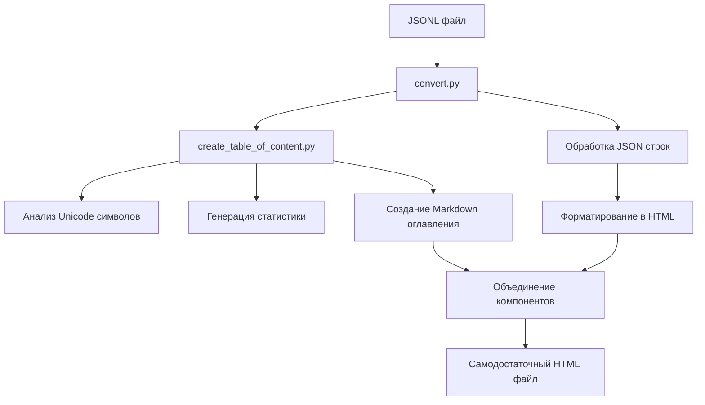

# Архитектура проекта

## Структура проекта и основные компоненты

Проект `jsonl2html` организован как стандартный Python-пакет с четким разделением логики, тестов и конфигурации.

*   **Исходный код (`jsonl2html/`)**: Основная директория, содержащая всю логику приложения.
    *   `convert.py`: Ядро утилиты, отвечающее за процесс конвертации.
    *   `create_table_of_content.py`: Модуль для анализа данных и генерации оглавления.
    *   `__init__.py`: Точка входа в пакет, определяющая публичный API и версию.
*   **Тесты (`tests/`)**: Директория с модульными тестами для проверки корректности работы ключевых функций. Используется `pytest` для запуска тестов.
*   **Конфигурационные файлы**:
    *   `pyproject.toml`: Стандартный файл для конфигурации сборки проекта и управления метаданными (имя, версия, зависимости).
    *   `requirements.txt`: Список внешних Python-зависимостей для установки через `pip`.
*   **Документация**:
    *   `ReadMe.md`: Основной файл с описанием проекта, инструкциями по установке и использованию.

## Процесс работы утилиты

Процесс работы утилиты выглядит следующим образом:



1.  Скрипт `convert.py` читает входной JSONL-файл.
2.  Он передает данные в модуль `create_table_of_content.py` для сбора статистики по символам Unicode и генерации оглавления в Markdown.
3.  `convert.py` обрабатывает каждую JSON-строку, форматируя ее в HTML.
4.  Все сгенерированные компоненты (оглавление, HTML-представление данных, стили, скрипты) объединяются в один самодостаточный HTML-файл.

## Точки входа

Проект предоставляет две основные точки входа:

### 1. Интерфейс командной строки (CLI)
*   **Описание:** Основной способ использования утилиты. Запускается через `convert.py`. Благодаря библиотеке `fire`, функции модуля становятся доступны как команды.
*   **Пример вызова:**
    ```bash
    python -m jsonl2html.convert <path_to_input.jsonl> <path_to_output.html>
    ```

### 2. Программный интерфейс (API)
*   **Описание:** Проект можно использовать как библиотеку в других Python-приложениях. Основная функция `convert_jsonl_to_html` доступна для импорта.
*   **Компонент:** `convert_jsonl_to_html` в `jsonl2html/__init__.py`.
*   **Пример использования:**
    ```python
    from jsonl2html import convert_jsonl_to_html

    convert_jsonl_to_html('input.jsonl', 'output.html')
    ```

## Структура файлов

```
jsonl2html/
├── jsonl2html/
│   ├── __init__.py          # Публичный API пакета
│   ├── convert.py           # Основной конвертер
│   ├── create_table_of_content.py  # Генератор оглавления
│   └── html_template.html   # HTML шаблон
├── tests/
│   ├── __init__.py
│   └── test_create_table_content.py
├── pyproject.toml           # Конфигурация проекта
├── requirements.txt         # Зависимости
└── README.md               # Документация
