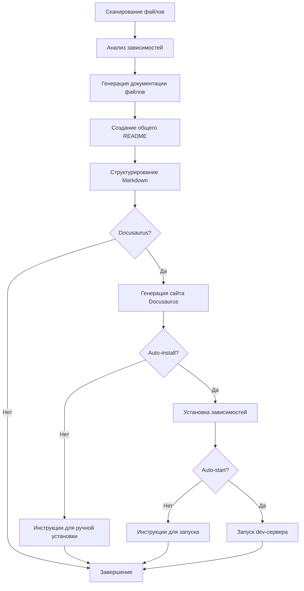

# Documentation Generator

Автоматический генератор технической документации для кодовых репозиториев с использованием анализа LLM.

## Описание

Этот инструмент анализирует кодовую базу проекта и генерирует структурированную техническую документацию в формате Markdown. Для каждого файла создается отдельная документация, а также общий обзор проекта с навигацией и анализом зависимостей. **Новая функция**: автоматическая генерация сайта Docusaurus для красивого отображения документации.

## Возможности

- **Анализ множественных языков программирования**: Python, JavaScript, TypeScript, Java, C/C++, Rust, Go
- **Извлечение зависимостей**: Автоматический анализ импортов и зависимостей между модулями
- **Структурированная документация**: Создание README с навигацией и отдельных файлов документации
- **Граф зависимостей**: Визуализация связей между компонентами проекта
- **Параллельная обработка**: Использование нескольких потоков для ускорения генерации
- **Поддержка различных форматов**: Markdown, JSON, TOML, YAML и другие
- **🆕 Генерация Docusaurus**: Автоматическое создание современного документационного сайта
- **🆕 Автоматическая установка**: Опциональная автоматическая установка зависимостей Docusaurus
- **🆕 Автозапуск**: Автоматический запуск dev-сервера Docusaurus

## Установка

```bash
pip install -r requirements.txt
```

Настройте API ключ OpenRouter в файле `.env`:
```bash
OPENROUTER_API_KEY=your_api_key_here
```

## Использование

### Стадия 1 и 2: Базовая документация (Markdown)

```bash
# Базовое использование - генерация Markdown документации
python main.py /path/to/your/project

# Указать директорию для документации
python main.py /path/to/project --output ./my-docs

# Настроить количество параллельных потоков
python main.py /path/to/project --workers 5

# Предварительный просмотр (dry run)
python main.py /path/to/project --dry-run

# Подробное логирование
python main.py /path/to/project --verbose
```

### Стадия 3: Генерация Docusaurus (НОВОЕ!)

```bash
# Генерация Markdown + Docusaurus сайта
python main.py /path/to/project --docusaurus

# Автоматическая установка зависимостей Docusaurus
python main.py /path/to/project --docusaurus --auto-install

# Полностью автоматический режим: генерация + установка + запуск
python main.py /path/to/project --docusaurus --auto-install --auto-start
```

### Полные примеры

```bash
# Документирование текущего проекта с Docusaurus
python main.py ../jsonl2html --docusaurus

# Полностью автоматический режим
python main.py ../my-project --docusaurus --auto-install --auto-start --output ./project-docs

# Проверка что будет документировано
python main.py ../my-project --dry-run --verbose
```

## Архитектура решения

Проект состоит из трех основных стадий:

### Стадия 1: Анализ файлов и генерация Markdown
- **`file_analyzer.py`** - Анализ файлов проекта и извлечение зависимостей
- **`openrouter_client.py`** - Клиент для работы с OpenRouter API (Gemini 2.5 Pro)
- **`documentation_generator.py`** - Основной класс для генерации документации

### Стадия 2: Создание структурированного README
- Генерация общего README с навигацией
- Создание файла dependencies.md с графом зависимостей
- Структурирование документации по папкам

### Стадия 3: Генерация Docusaurus (НОВОЕ!)
- **`docusaurus_generator.py`** - Генератор современного документационного сайта
- Автоматическое создание структуры Docusaurus
- Конвертация Markdown в формат Docusaurus
- Опциональная установка зависимостей и запуск

### Рабочий процесс



## Поддерживаемые языки

| Язык | Расширения | Анализ зависимостей |
|------|------------|-------------------|
| Python | `.py` | ✅ (import, from) |
| JavaScript | `.js`, `.jsx` | ✅ (import, require) |
| TypeScript | `.ts`, `.tsx` | ✅ (import, require) |
| Java | `.java` | ✅ (import) |
| C/C++ | `.c`, `.cpp`, `.h`, `.hpp` | ✅ (#include) |
| Rust | `.rs` | ✅ (use) |
| Go | `.go` | ✅ (import) |
| Config | `.toml`, `.yaml`, `.json` | ✅ |
| Docs | `.md`, `.txt` | ✅ |

## Результат

### Markdown документация (Стадии 1-2)

```
docs/
├── README.md                    # Главный обзор проекта
├── dependencies.md              # Граф зависимостей
├── file1.py.md                 # Документация для file1.py
├── file2.js.md                 # Документация для file2.js
└── subdirectory/
    └── module.py.md            # Сохраняется структура директорий
```

### Docusaurus сайт (Стадия 3)

```
project-name-docusaurus/
├── README.md                   # Инструкции по запуску
├── website/                    # Docusaurus проект
│   ├── package.json           # Зависимости Node.js
│   ├── docusaurus.config.js   # Конфигурация Docusaurus
│   ├── sidebars.js           # Навигация сайдбара
│   ├── src/                  # Компоненты React
│   └── docs/                 # Документация в формате Docusaurus
└── docs/                     # Исходная Markdown документация
```

## Особенности Docusaurus интеграции

### Автоматические функции
- **Конвертация Markdown**: Автоматическое преобразование в формат Docusaurus
- **Навигация**: Генерация sidebar с иерархической структурой
- **Конфигурация**: Автоматическая настройка docusaurus.config.js
- **Главная страница**: Создание красивой главной страницы
- **Поиск**: Встроенный поиск по документации

### Опции запуска
- `--docusaurus`: Включить генерацию Docusaurus
- `--auto-install`: Автоматически установить npm зависимости
- `--auto-start`: Автоматически запустить dev-сервер (http://localhost:3000)

### Ручной запуск Docusaurus
Если не использовали `--auto-install`:

```bash
cd project-name-docusaurus/website
npm install
npm start
```

## Настройка

### Переменные окружения

```bash
OPENROUTER_API_KEY=sk-or-v1-...    # Обязательно
OPENAI_BASE_URL=https://openrouter.ai/api/v1  # Опционально
```

### Настройка модели

По умолчанию используется `google/gemini-2.5-flash-preview-05-20`. Можно изменить в файле `openrouter_client.py`.

## Требования для Docusaurus

- **Node.js** >= 16.14
- **npm** >= 7.0
- Автоматически устанавливается при использовании `--auto-install`

## Примеры проектов

Инструмент был протестирован на:
- **jsonl2html** - Python утилита для конвертации JSONL в HTML
- Различные JavaScript/TypeScript проекты
- Go и Rust проекты

## Разработка

Для разработки и тестирования:

```bash
# Клонирование и установка
git clone <repo>
cd playground
pip install -r requirements.txt

# Тестирование на примере проекта
python main.py ../jsonl2html --dry-run --verbose

# Полный тест с Docusaurus
python main.py ../jsonl2html --docusaurus --auto-install --auto-start
```

## Troubleshooting

### Проблемы с Node.js
Если возникают проблемы с Node.js/npm:
```bash
# Проверка версий
node --version  # должно быть >= 16.14
npm --version   # должно быть >= 7.0

# Установка Node.js через nvm (рекомендуется)
curl -o- https://raw.githubusercontent.com/nvm-sh/nvm/v0.39.0/install.sh | bash
nvm install 18
nvm use 18
```

### Проблемы с API ключом
```bash
# Проверка API ключа
echo $OPENROUTER_API_KEY

# Тест подключения
python -c "from openrouter_client import OpenRouterClient; print('API OK')"
```

## Лицензия

MIT License

## Changelog

### v1.0.0 (НОВОЕ!)
- ✅ Стадия 1: Анализ файлов и генерация Markdown документации
- ✅ Стадия 2: Создание структурированного README
- ✅ Стадия 3: Автоматическая генерация Docusaurus сайта
- 🆕 Автоматическая установка зависимостей Docusaurus
- 🆕 Автоматический запуск dev-сервера
- 🆕 Современный веб-интерфейс для документации
- 🆕 Встроенный поиск и навигация
